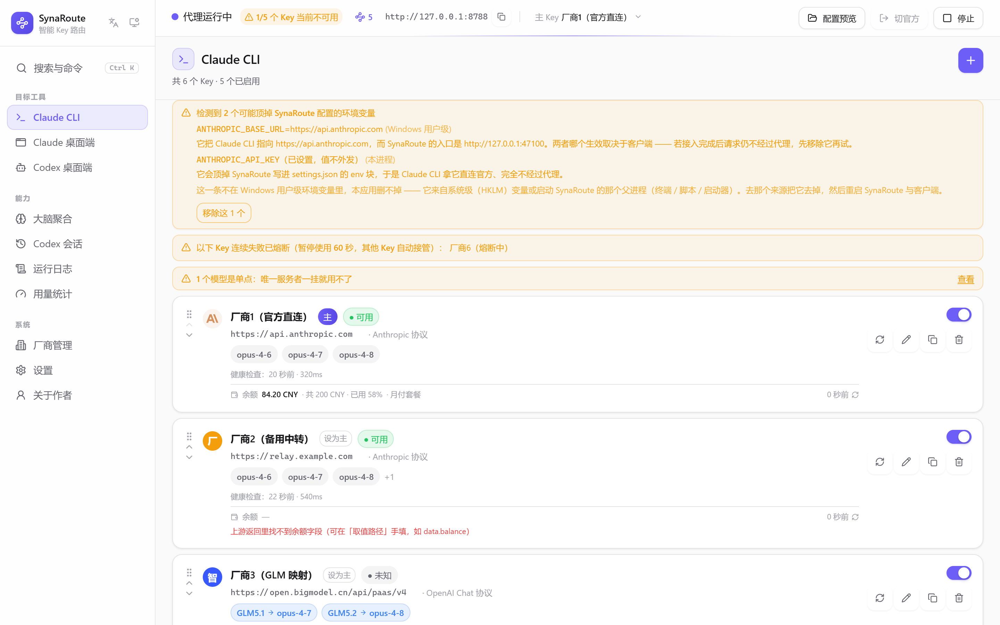

<div align="center">


# SynaRoute

**多个 Key 互为备份，多个模型协同思考**

本机运行的 API 路由代理，为 Claude CLI、Claude 桌面端和 Codex 桌面端统管多家厂商的 Key 与模型。<br>
主 Key 报错自动换下一个；也能让多个模型并行回答同一个问题，再由决策者综合出结论。

[官网](https://synaroute.mofamilys.com) ·
[下载](https://github.com/EngineeMoMo/SynaRoute/releases/latest) ·
[CLI 接入手册](docs/12-CLI用户手册.md) ·
[大脑聚合](docs/10-大脑聚合使用说明.md) ·
[MCP 接入](docs/06-MCP使用手册.md)


</div>

---

## 这是什么

你有多个 AI 服务的 Key（不同厂商、不同中转站），希望：

- 一个 Key 限流或报错时**自动切到下一个**，不用手动改配置；
- 厂商的真实模型名和客户端期望的对不上时**自动映射**；
- 密钥**本机加密存放**，不散落在各处明文配置里。

SynaRoute 在 `127.0.0.1` 上起一个本地代理端口，客户端把请求发给它，它再按你的规则转发给真正的上游。**只监听本机，不对外**。

<div align="center">

<br><sub>截图取自软件的浏览器预览模式，其中的地址与 Key 均为示例数据</sub>
</div>

## 功能

| | |
|---|---|
| **故障转移路由** | Key 按列表顺序构成优先级，从上往下找第一个可用的。切换前做健康探测，连续失败的 Key 进入短路窗口被临时跳过，窗口结束自动重新参与。上游返回的限流等待时间透传给客户端，不吞掉。 |
| **大脑聚合** | 同一个问题交给多个模型并行回答，再由你指定的决策模型综合出结论。两种汇总策略（压缩汇总省额度 / 全量上下文保信息），成员可按需只读检索工作目录里的代码，也支持传图。另可作为 MCP 工具供 Codex CLI 与 Claude Code 调用。 |
| **跨协议转换** | Anthropic Messages、OpenAI Chat Completions、OpenAI Responses 三种协议两两互转，请求体、非流式响应体与流式 SSE（六个方向）全覆盖，含工具调用与多轮历史。**故障转移可以跨协议** —— 主 Key 和备用 Key 不必是同一家厂商。 |
| **模型映射** | 把厂商真实模型名映射成客户端认识的名字，客户端仍按熟悉的名字调用。可配兜底模型，用于候选 Key 不提供所请求模型时的降级。 |
| **加密密钥存储** | 默认用 Windows 数据保护接口（DPAPI）加密，密文与当前 Windows 账户绑定。可选开启主口令增强模式，改用 Argon2id 派生密钥配合 AES-GCM。 |
| **一键接入客户端** | 启动代理时自动把端点写进对应客户端的配置文件，停止时还原，写入前先备份。三个客户端各写各的字段，互不覆盖。界面里可先预览再决定。 |
| **运行日志** | 每次转发命中哪个 Key、模型被解析成什么、上游返回什么状态、是否发生转移，都可查、可搜索、可导出诊断报告。记录完整对话正文的开关默认关闭。 |
| **配置导入导出** | 整套配置可打包带走，支持合并或覆盖导入。含密钥的导出用你设定的口令重新加密（密钥密文绑本机账户，换机器解不出）。 |
| **托盘与自启动** | 常驻托盘，图标随代理运行状态变化。右键可分别启停三个分类的代理、快速切换主 Key。可选开机自启并最小化到托盘。 |

## 安装

到 [Releases](https://github.com/EngineeMoMo/SynaRoute/releases/latest) 下载 `SynaRoute_<版本>_x64-setup.exe`，双击安装（当前用户安装，无需管理员）。

- **系统要求**：Windows 10 (1809) 或 Windows 11
- 首次运行若缺 WebView2，安装包会自动下载安装（Win11 一般自带）
- **macOS 版尚未构建**，在计划内
- 软件内置在线更新，也可以直接装新版覆盖

装好后照 [CLI 接入手册](docs/12-CLI用户手册.md) 走三步就能跑起来：加 Key → 点启动 → 客户端直接用。

## 从源码构建

需要 [Node.js](https://nodejs.org/) 18+、[Rust](https://rustup.rs/) 稳定版，以及 Windows 上的 MSVC 工具链。

```bash
npm install
npm run tauri build
```

> [!IMPORTANT]
> **生产 exe 必须用 `tauri build`，不要用裸 `cargo build --release`。**
> 裸 cargo 构建不执行前端构建、不嵌入 `dist`，产出的 exe 运行时会去连 `localhost:1420`，
> 在没有 dev server 的机器上直接白屏。详见 [构建部署指南](docs/04-构建部署指南.md)。

只想快速验证、不要安装包时加 `-- --no-bundle`。跑测试：

```bash
cd src-tauri && cargo test --lib
```

## 数据与隐私

- **全部在本机。** 配置与加密后的密钥位于当前用户应用数据目录下的 `SynaRoute` 文件夹（`%APPDATA%\SynaRoute\{config.json, secrets.enc}`），没有服务器端存储。
- **只往外发两种请求**：你自己配置的上游厂商地址，以及检查新版本时对 GitHub 发布页的请求。不收集使用数据、没有账号体系、不做配置同步。
- **日志默认只记元信息**（时间、命中的 Key、模型、上游状态码）。「记录调用模型日志」开关默认关闭，开启后日志才会包含完整对话正文（含系统提示词），建议排障时临时开、查完关掉。
- **卸载后**删掉那个 `SynaRoute` 文件夹即可清除全部配置与密钥，软件不在其他位置留存数据。

需要你知道的两点风险：本地代理监听在回环地址上，同一台机器上的其他程序理论上可以访问该端点，请不要把代理端口暴露到公网；DPAPI 加密防的是文件被复制走，不防已经登录了你账户的程序。

## 文档

面向使用者：

- [CLI 用户手册](docs/12-CLI用户手册.md) —— Claude Code 命令行接入，从装到跑通
- [大脑聚合使用说明](docs/10-大脑聚合使用说明.md) —— 多模型并行 + 决策者汇总怎么配
- [MCP 使用手册](docs/06-MCP使用手册.md) —— 把大脑聚合作为 MCP 工具接入 Codex CLI / Claude Code

面向开发与维护：

- [需求规格说明书](docs/01-需求规格说明书.md) · [技术架构设计](docs/02-技术架构设计文档.md) · [UI/UX 设计](docs/03-UIUX设计文档.md)
- [构建部署指南](docs/04-构建部署指南.md) —— 构建流程与踩过的坑
- [交接与待办清单](docs/14-交接与待办清单.md) —— 接手必读
- [架构评审报告](docs/15-架构评审报告.md) —— 问题分级、优化方案与「不建议改动」清单
- [MSIX 虚拟化踩坑复盘](docs/11-MSIX虚拟化踩坑复盘.md)

官网源码在 [`site/`](site/) 目录，是独立的 npm 工程，见 [site/README.md](site/README.md)。

## 反馈

用着有问题欢迎提 [Issue](https://github.com/EngineeMoMo/SynaRoute/issues)。附上软件内「导出诊断报告」生成的文件会更容易定位问题 —— 该报告不含密钥明文。

**提 Issue 时请不要贴真实的 API Key。**

## 许可

源码公开在本仓库供查阅，但**目前尚未附带开源许可证**。在作者另行声明之前，未经许可请勿再分发、二次打包或商业分发。查阅、自行构建、自己使用都没有问题。

---

<div align="center">
<sub>作者 <a href="https://github.com/EngineeMoMo">@EngineeMoMo</a> · <a href="https://synaroute.mofamilys.com">synaroute.mofamilys.com</a></sub>
</div>
